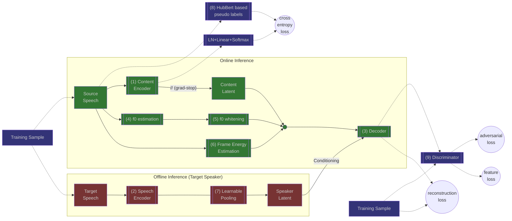

# StreamVC
An unofficial pytorch implementation of [STREAMVC: REAL-TIME LOW-LATENCY VOICE CONVERSION](https://arxiv.org/pdf/2401.03078.pdf) created for learning purposes.

This is not an official product, and while the code should work, I don't have a trained model checkpoint to share.
If you successfully trained the model, I encourage you to share it on Hugging Face, and ping me so I can link it here.

The streaming inference as it is in the paper isn't fully implemented, and I have no plans to implement it.



## Example Usage
### Training
#### Requirements
To install the requirements for training run:
```bash
pip install -r requirements-training.txt
```
#### Preprocess the datasets
`preprocess_dataset.py` is the python script for dataset preprocessing.
This script downloads the specified LibriTTS split, compress it locally into `ogg` files,
and creates the HuBert labels for it.
To  view the dataset and see the available splits, go to [mythicinfinity/libritts](https://huggingface.co/datasets/mythicinfinity/libritts).
To launch the script, run:
```bash
python preprocess_dataset.py --split [SPLIT-NAME]
```
It is recommended to download all the train splits as well as the clean dev & test at least.
To see additional available option:
```bash
python preprocess_dataset.py --help
```

#### Running the training script
`train.py` is the python script for training, it uses [🤗 Accelerate](https://huggingface.co/docs/accelerate).
To configure Accelerate to your environment use [`accelerator config`](https://huggingface.co/docs/accelerate/package_reference/cli#accelerate-config).

To launch the script, run:
```bash
accelerate launch [ACCELERATE-OPTIONS] train.py [TRAINING-OPTIONS]
```
To see the available training options, run: 

```bash
python train.py --help
```

The training of StreamVC consists of 2 parts - the Content Encoder training and the Decoder/Speech Encoder Training.
An example of launching the training script: (hyperparameter tuning is needed, and there are many options)
```bash
# Content Encoder training
accelerate launch \
     train.py content-encoder \
     --run-name svc_111 \
     --batch_size 64 \
     --num-epochs 7 \
     --datasets.train-dataset-path "./dataset/train.clean.360" "./dataset/train.clean.100" "./dataset/train.other.500" \
     --model-checkpoint-interval 500 \
     --accuracy-interval 200 \
     lr-scheduler:one-cycle-lr \
     --lr-scheduler.div_factor 15 \
     --lr-scheduler.final_div_factor 1000 \
     --lr-scheduler.max 7e-4 \
     --lr-scheduler.pct_start 0.2

# Decoder training, it is required to pass the Content Encoder checkpoint
accelerate launch \
    train.py decoder \
    --run-name svc_112 \
    --batch_size 48 \
    --num-epochs 5 \
    --lr 1e-5 \
    --datasets.train-dataset-path "./dataset/train.clean.360" "./dataset/train.clean.100" "./dataset/train.other.500" \
    --model-checkpoint-interval 500 \
    --log-gradient-interval 500 \
    --content-encoder-checkpoint "./checkpoints/svc_111_content_encoder/model.safetensors" \
    lr-scheduler:cosine-annealing-warm-restarts \
    --lr-scheduler.T-0 3000
```
### Inference
#### Requirements
To install the requirements for inference run:
```bash
pip install -r requirements-inference.txt
```
#### Running the script
 `inference.py` is the python script for inference on a single source & target combo.


To launch the script, run:
```bash
python inference.py -c <model_checkpoint> -s <source_speech> -t <target_speech> -o <output_file>
```
To see the available inference options, run: 

```bash
python inference.py --help
```

## Acknowledgements
This project was made possible by the following open source projects:

 - For the encoder-decoder architecture (based on SoundStream) we based our code on [AudioLM's official implementation](https://github.com/lucidrains/audiolm-pytorch).
 - For the multi-scale discriminator and the discriminator losses we based our code on [MelGan's official implementation](https://github.com/descriptinc/melgan-neurips).
 -  For the HuBert discrete units computation we used the HuBert + KMeans implementation from [SoftVC's official implementation](https://github.com/bshall/soft-vc).
 - For the Yin algorithm we based our implementation on the [torch-yin package](https://github.com/brentspell/torch-yin).